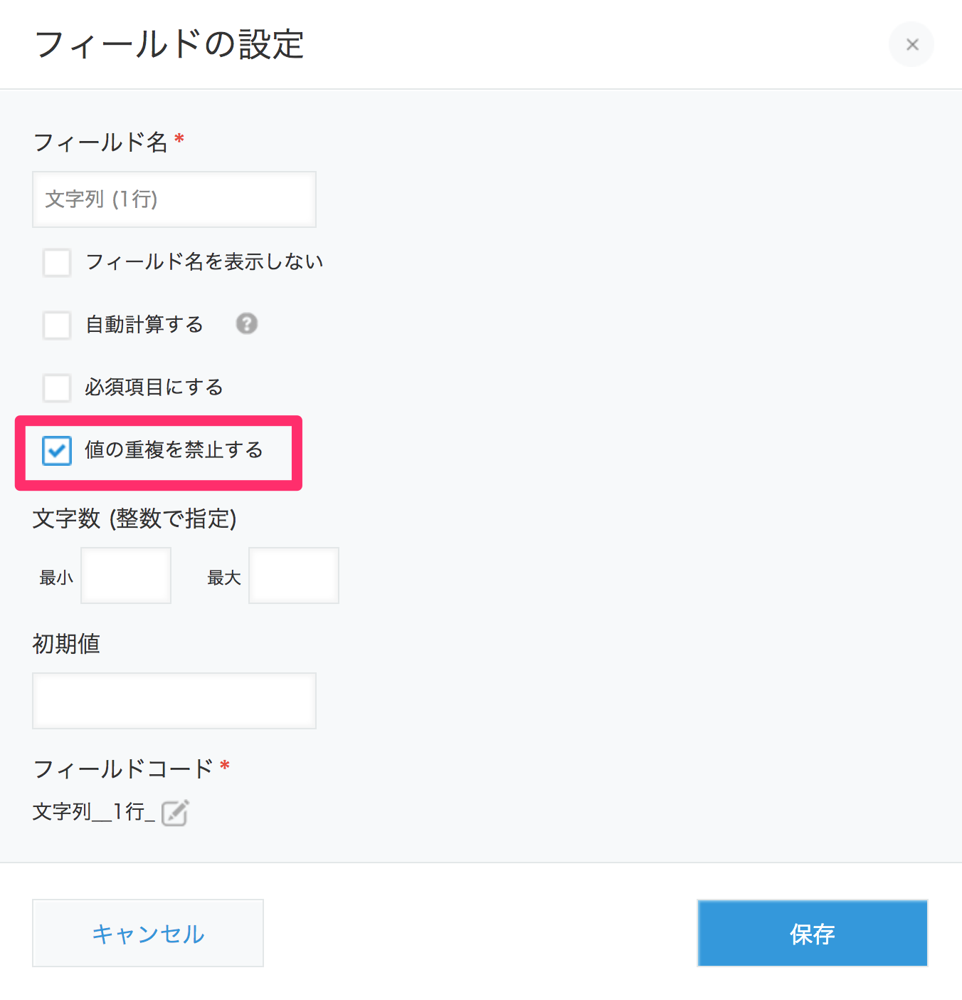
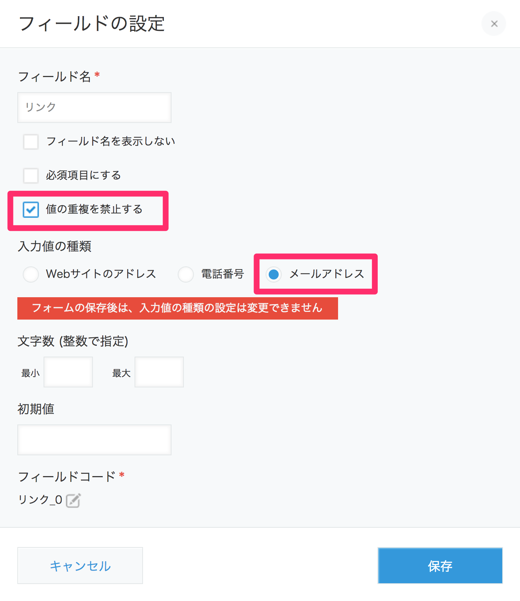

# SendGrid kintoneプラグインとは

本プラグインはkintoneからSendGridを利用してメール送信するためのものです。kintone上で管理している顧客リストや会員リストなどに対して、メールを一斉送信できます。

メールのテンプレートはSendGridの[Webポータル](https://sendgrid.com/templates/)上で編集します。メール本文に対して宛先ごとに文字の埋め込み（宛名やクーポンコードなど）を行うことができます。

# 前提条件

本プラグインを利用する前に次のものを用意してください。

- [kintone](https://kintone.cybozu.com/jp/)のシステム管理権限を持ったアカウント
- [SendGrid](https://sendgrid.kke.co.jp)のアカウント

# 利用方法

## アプリケーションの準備

SendGrid kintoneプラグインが動作するためにアプリケーション側では宛先アドレスを格納するフィールドが最低限必要になります。宛先アドレスを格納するフィールドは次の条件を満たしている必要があります。

- 値の重複を禁止すること
- 「文字列(1行)」フィールドまたは、「リンク」フィールド(入力値の種類＝メールアドレス)

具体的な設定画面は次のとおりです。

- 文字列(1行)フィールドの場合  
値の重複を禁止する必要があります。

- リンクフィールドの場合  
値の重複を禁止し、入力値の種類を「メールアドレス」にする必要があります。

## プラグインのインストールと有効化

### プラグインの読み込み

最新版のプラグインを[こちらからダウンロード](https://github.com/SendGridJP/kintone-sendgrid-plugin/blob/master/plugin.zip?raw=true)して読み込みます。詳しい手順は[こちら](https://help.cybozu.com/ja/k/admin/plugin.html)を参照してください。
※GitHubからソースコードを取得して[plugin-sdk](https://github.com/kintone/plugin-sdk)でパッケージングすることもできます。パッケージングの手順は[こちら](https://developer.cybozu.io/hc/ja/articles/203283794)をご確認ください。

### アプリへのプラグインの追加

「アプリの設定 > プラグイン」からSendGridプラグインを追加します。

## プラグインの設定

## メール送信
